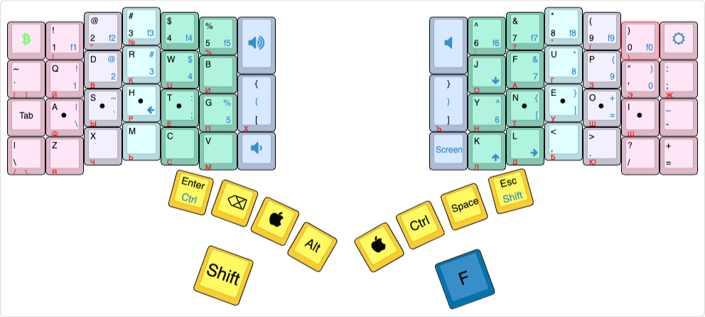
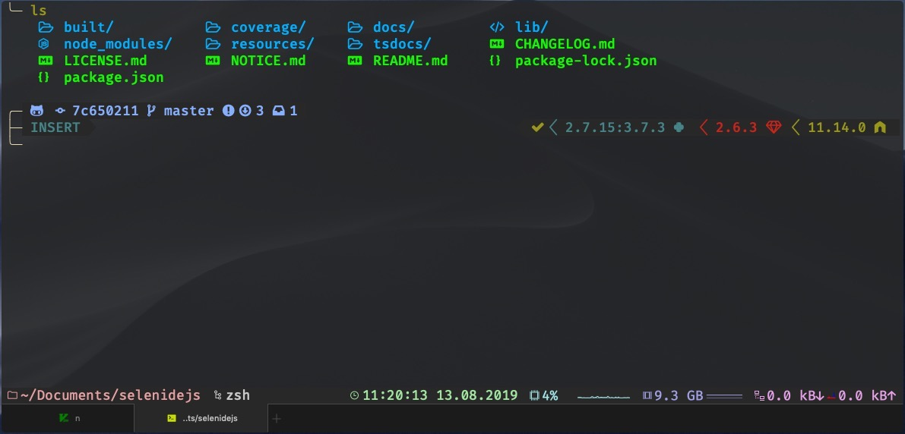
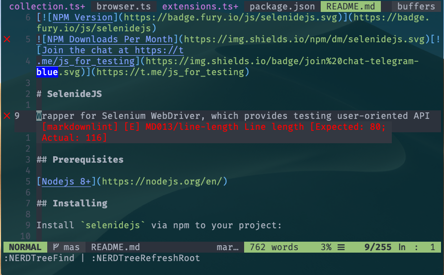

# Dotfiles

## What's inside

* MacOS settings based on
[Mathias dotfiles](https://github.com/mathiasbynens/dotfiles) repository.
* Languages:
  * nvm + NodeJS
  * sdkman + Java
  * pyenv + Python
  * rbenv + Ruby
  * gvm + Golang
* Software
* Karabiner Elements with [complex modifications](karabiner/karabiner.json)
* Global configs:
  * [gitconfig](./configs/gitconfig)
  * [gitignore](./configs/gitignore)
  * [editorconfig](./configs/editorconfig)
  * [eslintrc](./configs/eslintrc)
* keyboardio layout 
* Badass terminal - iterm2 + Powerlevel9k + Nerd Fonts + [Zshell](https://github.com/robbyrussell/oh-my-zsh/wiki/Cheatsheet) with plugins and tools

* NeoVim (nightly v0.4.0-1015-gbabcf641e) with bunch of plugins, color schemes and [cheatsheet](vim.md)

## Installation

Since we will be installing environment managers like `rbenv` and
settings MacOS it's required to reload your mac at some point of installation.
For this purposes installation process consists from two install scripts,
read below how to use them.

Notes:

* for installing apps from `mas` you should be logged in Mac Apple store,
otherwise there will be warning while installation
* you might want to add some apps to startup after installation

1. Install package/langs managers:
   * `curl https://raw.githubusercontent.com/aleksanderpopov/.dotfiles/master/install/managers.sh | bash`
2. Open new terminal session
3. Install langs/software/configs:
   * `curl https://raw.githubusercontent.com/aleksanderpopov/.dotfiles/master/install/main.sh | bash`
4. (Optional) Setup some macos settings which require disabling [System Integrity Protection](https://christianvarga.com/how-to-delete-sleepimage-on-macos-high-sierra/)
   * > Restart your machine and hold down CMD + R to boot into recovery mode.
     > When that loads, go to Utilities - Terminal,
     > and enter the following to disable SIP:

      `csrutil disable; reboot`

   * When your machine starts back up run following script:

      `curl https://raw.githubusercontent.com/aleksanderpopov/.dotfiles/master/install/macos_optional.sh | bash`

   * Boot into recovery mode again and re-enable SIP:

      `csrutil enable; reboot`

   * When you're back into macos verify that SIP enabled and the sleepimage has a size of 0 bytes:

      `csrutil status; ls -la /private/var/vm`

## Additional customization

* you can use Gruvbox theme instead of default Solarized Dark using import `./terminal/gruvbox-dark.itermcolors`

### TODO

* fix trailing whitespaces on NOT markdown files
* save alfred settings
* setup alfred to be able to open nvim in fuzzy search directory?
* document most useful alfred shortcuts
* export magnet shortcut settings somehow
* suggested [software](https://github.com/jaywcjlove/awesome-mac)
  * [better touch tool](https://folivora.ai)
  * [console player](https://cmus.github.io/#features)
  * mail clients?:
* track on [isssue](https://github.com/mads-hartmann/bash-language-server/issues/131) on bash-language-server
* `where` command not found after installation
* `.bash_profile` does not getting read after installing managers like `nvm` - try to add source script and use it in main/separate?

