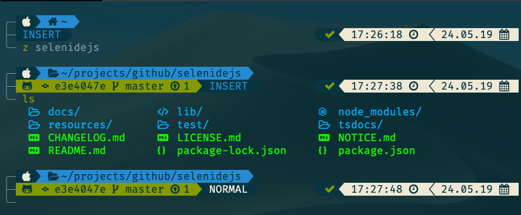

# Dotfiles

## What's inside

* MacOS settings based on [Mathias dotfiles](https://github.com/mathiasbynens/dotfiles) repository.
* [ asdf ](https://github.com/asdf-vm/asdf) with nodejs, java, python, ruby, etc.
* [Alfred](https://www.alfredapp.com/) with some customizations and [cheetsheet](alfred.md)
* Global configs:
  * [gitconfig](./configs/gitconfig)
  * [gitignore](./configs/gitignore)
  * [editorconfig](./configs/editorconfig)
  * [eslintrc](./configs/eslintrc)
  * [tigrc](./configs/tigrc)
* [ergodox ez layout](https://configure.ergodox-ez.com/ergodox-ez/layouts/QaJY3/latest/0)
* Badass terminal - iterm2 + [ Zshell ](https://en.wikipedia.org/wiki/Z_shell) + [ Powerlevel10k ](https://github.com/romkatv/powerlevel10k) + Nerd Fonts + [Zinit](https://github.com/zdharma/zinit), etc.

* NeoVim with bunch of plugins, color schemes and [cheatsheet](vim.md)


* (ARCHIEVED)[iterm2 configs](./terminal/iterm2/)
* (ARCHIEVED)[keyboardio layout](http://www.keyboard-layout-editor.com/#/gists/4782bb723fbd9c12adfc23d293e9af0c)
* other:
  * [gmail cleanup script](./gmail-script.js)
  * cron backup for [lastpass](./backup/lastpass.sh) and [keybaseio](./backup/keybase.sh)
    * how to use ```
        0 * * * * $HOME/.dotfiles/backup/mailOnErr.sh $HOME/.dotfiles/backup/lastpass.sh
        0 * * * * $HOME/.dotfiles/backup/mailOnErr.sh $HOME/.dotfiles/backup/keybase.sh
      ```

## Installation

Notes:

* for installing apps from `mas` you should be logged in Mac Apple store,
otherwise there will be warning while installation
* you might want to add some apps to startup after installation

1. Install main stuff (managers, langs, software, etc)
   * `curl https://raw.githubusercontent.com/aleksanderpopov/.dotfiles/master/install.sh | bash`
2. (Optional) Setup some macos settings which require disabling [System Integrity Protection](https://christianvarga.com/how-to-delete-sleepimage-on-macos-high-sierra/)
   * > Restart your machine and hold down CMD + R to boot into recovery mode.
     > When that loads, go to Utilities - Terminal,
     > and enter the following to disable SIP:

      `csrutil disable; reboot`

   * When your machine starts back up run following script:

      `curl https://raw.githubusercontent.com/aleksanderpopov/.dotfiles/master/macos_optional.sh | bash`

   * Boot into recovery mode again and re-enable SIP:

      `csrutil enable; reboot`

   * When you're back into macos verify that SIP enabled and the sleepimage has a size of 0 bytes:

      `csrutil status; ls -la /private/var/vm`

## Additional customization

* you can use Gruvbox theme instead of default Solarized Dark using import `./terminal/gruvbox-dark.itermcolors`

## Useful links
* how to configure `mail` for crontab gmail on macos https://gist.github.com/giovanigenerali/39efe8760f84ed74b44a31be1ace27e7
### TODO

* add WireGuard installation
* rewrite time tracking alfred plugin to be able to start timer for project without searchin for them
* suggested [software](https://github.com/jaywcjlove/awesome-mac)
  * [better touch tool](https://folivora.ai)
  * [console player](https://cmus.github.io/#features)
  * mail clients?:

