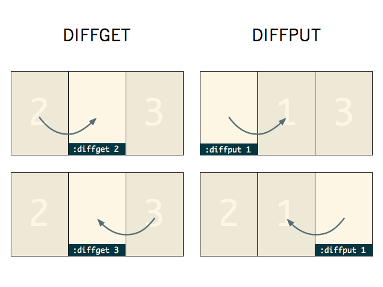
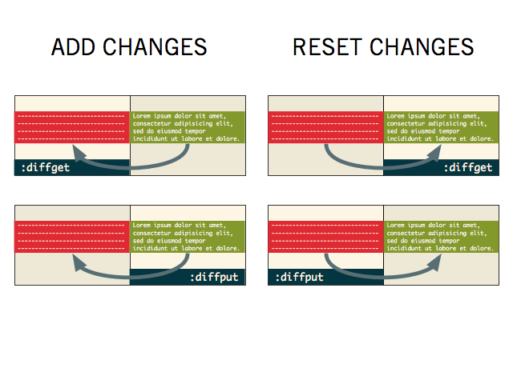
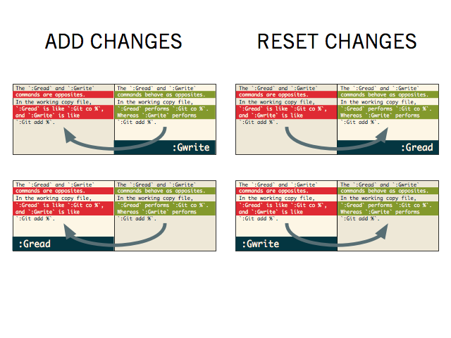
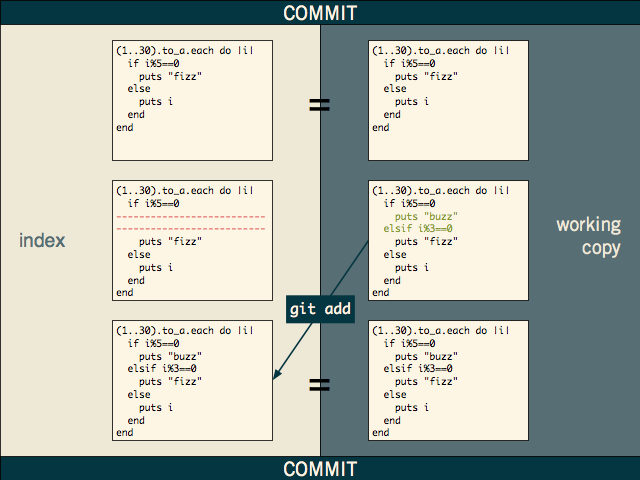

# List of shortcuts available in nvim

* `<C-j/k/l/p>` - move between buffers/split
* `<C-q>`/`<C-Q>` - write and close current/all buffers
* folding (collapse and uncollapse code lines)
  * `za` - toggle folding for current indent
  * `zM` - fold everything
  * `zR` - unfold everything
  * `zo` - open fold
  * `zc` - close a fold
* `<C-j>`/`<C-k>` - navigate through quicklist/popup/etc
* `<leader>ff` - apply formatting for entire file
* `<leader>dg` - alias for :diffget
* `<leader>dp` - alias for :diffput
* `<C-e>` - exit from integrated terminal interaction mode

## Plugins

### File System

* [scroloose/nerdtree](https://github.com/scrooloose/nerdtree)
  * `<leader>ft` - show/hide file tree + refresh
  * `<leader>fc` - show current file in file tree + refresh

### Text Objects, Surround

* [wellle/targets.vim](https://github.com/wellle/targets.vim/blob/master/cheatsheet.md)
* [michaeljsmith/vim-indent-object](https://github.com/michaeljsmith/vim-indent-object#usage)
* [tpope/vim-surround](https://github.com/tpope/vim-surround)

### Search

* [junegunn/fzf](https://github.com/junegunn/fzf)
  * `<leader>/F` - find file
  * `<leader>/gf` - find file under git
  * `<leader>/gc` - find commit
  * `<leader>/fc` - find text in files
  * `<C-x>` / `<C-v>` - to open selected file in horizontal or vertical splits
* [haya14busa/incsearch.vim](https://github.com/haya14busa/incsearch.vim)
  * `/`/`?` - search next/previos/leave to highlight
  * `*`/`#` - search for current word next/previos
  * `z/`/`z?` - fuzzy search next/previos/leave to highlight
  * `Tab`/`<Shift-Tab>` - while searching to move between occurences

### Code navigate/refactor

* [neoclide/coc.nvim](https://github.com/neoclide/coc.nvim)
  * `gd` - coc-definition
  * `gy` - coc-type-definition
  * `gi` - coc-implementation
  * `gr` - coc-references
  * `K` - on hover show documentation
  * `[r` and `]r` - navigate through diagnostic
  * `[l` and `]l` - navigate through linter errors
  * `<leader>y` - show latest yanks
  * `<leader>f` - format indent for selected lines
  * `<leader>qf` - fix errors on current line
* [tpope/vim-commentary](https://github.com/tpope/vim-commentary)
  * `gcc` - to comment line (works with 'motion' and visual mode)
* [terryma/vim-multiple-cursors](https://github.com/terryma/vim-multiple-cursors)
  * `<C-n>` - select next place
  * `<C-x>` - skip next match
  * You can now change the virual cursots + selection with visual mode commands
(f.e. `c`, `I`, `A` will work fine). You could also go to
normal mode by pressing `v` and use normal commands there.
* [tpope/vim-unimpaired](https://github.com/tpope/vim-unimpaired)
  * `[a`/`]a` - previos/next file
  * `[A`/`]A` - firts/last file
  * `[b`/`]b` - previos/next buffer
  * `[B`/`]B` - first/last buffer
  * `[f`/`]f` - go to previos/next file
  * `[n`/`]n` - go to previos/next SCM conflict marker of diff
  * `[t`/`]t` - display previous/next tag
  * `[T`/`]T` - display first/last tag
  * `[<Space>`/`]<Space>` - add [count] blank lines above/below the cursor
  * `[e`/`]e` - exchange current line with [count] lines above/below it
  * `[p`/`]p` - paste on previos/next line
* [svermeulen/vim-subversive](https://github.com/svermeulen/vim-subversive)
  * `<leader>p<motion>` - subversive substitute (replace 'motion' with yanked chunk)
  * `<leader>pp` - subversive substitute line
  * `<leader>P` - subversive substitute to the EOL

### Other

* [iamcco/markdown-preview](https://github.com/iamcco/markdown-preview.nvim)
  * `:MarkdownPreview` - to open preview of current buffer md
  * `:MarkdownPreviewStop` - to close preview

### Git

* [tpope/vim-fugitive](https://github.com/tpope/vim-fugitive)
  * `<leader>gw`/`:Git add %` === `:Gwrite` - writes changes in working copy to index
  * `<leader>gr`/`:Git checkout %` === `:Gread` - reads index to working copy
  * `<leader>gc`/`:Git commit %` === `:Gcommit`
  * `<leader>gs`/`:Gstatus` - interactive git status with ability to stage changes:
  * `<leader>gla`/`:Glog --`, `<leader>gl`/`:0Glog` - show history in quicklist and
current buffer for all files or current file
    * use `-<NUMBER>` - flag to limit output commits
    * use `--reverse` - to load in reverse chronological order
    * use `until=<DAY>` - to limit by date (f.e. `yesterday`)
    * use `-S<PATTERN>` - to search for `<PATTERN>` diff for
each commit (f.e. `:Glog -Sfindme --`)
  * `<leader>gd`/`:Gdiff`, `:Gvdiff`, `:Gsdiff` - show interactive diffs:
    * `diffget` or `do` - pulls changes from other diffbuff to current diffbuff
    * `diffput` or `dp` - puts changes in current diffbuff to other diffbuff
    * `:Gwrite` and `:Gread` - also work for diffbuff
(writes/takes all changes from other diffbuff)
  * `:Git` - alternative to usual git, with some autocompletion
  * `:Git rm %` === `Gremove`
  * `:Git mv % target_path` === `:Gmove target_path`
  * Mappings
    * Staging and resetting
      * `s`/`u` - stage/unstage the file or hunk under the cursor
      * `-` - toggle stage/unstage file or hunk
      * `X` - discard change
      * `=` - toggle inline diff
      * `dd` - to view diffs
      * `P` - run `git add --patch` for file under the cursor (interactive `git add`)
    * Navigation
      * `<CR>` - open file under the cursor
      * `o` - open file under the cursor in new split
      * `gO` - open file under the cursor in new vertical split
      * `C` - open the commit containing the current file
    * Commit
      * `cc` - create a commit
      * `ca` - amend the last commit and edit the message
      * `ce` - amend the last commit without editing the message
      * `cw` - reword the last commit

